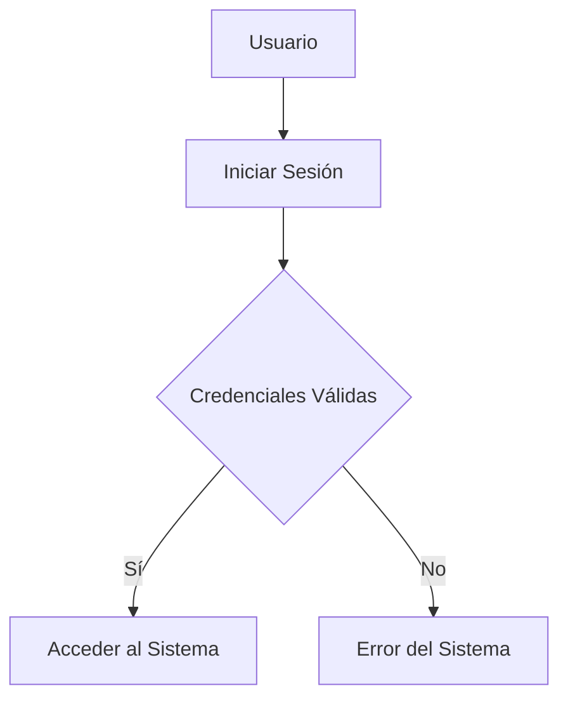
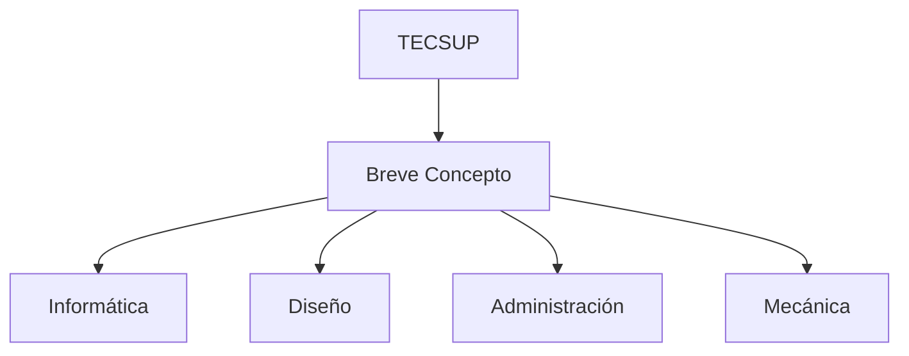

# Índice

- [Título](#titulo-importante)
- [Funciones](#funciones)
- [Tablas](#creando-tablas)
- [Mermaid Diagramas](#mermaid-diagramas)
- [Mapa conceptual de TECSUP](#mapa-conceptual-de-tecsup)

# Título Importante

Me encuentro aprendiendo *Markdown* en las clases del profesor Luis Pallin.

## Subtitulo 01

Aquí verificamos cómo formatear diferentes **tipos de texto**.

## Subtitulo 02

Podremos conocer diferentes tipos de formatos de textos usando ~~Markdown~~.

### Creando Hipervínculos

[Google](https://www.google.com)

[Tecsup](https://www.tecsup.edu.pe)

## Colocar Imágenes


## Funciones

- [x] Registrar Alumno
- [x] Generar Matricula
- [ ] Campo Vacio
- [ ] Libre

## Creando Tablas

| Lenguaje de Programación | Creador |
| ------------------------ | ------- |
| Java | James Gosling |
| PHP | Rasmus Lerdorf |
| Python | Guido Van Rossum |

## Codigo

```html
<h1>Hola Mundo</h1>
```

```css
body {
    background: red;
}
```

```java
public class Main {
    public static void main(String[] args) {
        System.out.println("Hola Mundo cruel");
    }
}
```

## Mermaid Diagramas



## Mapa conceptual de TECSUP

